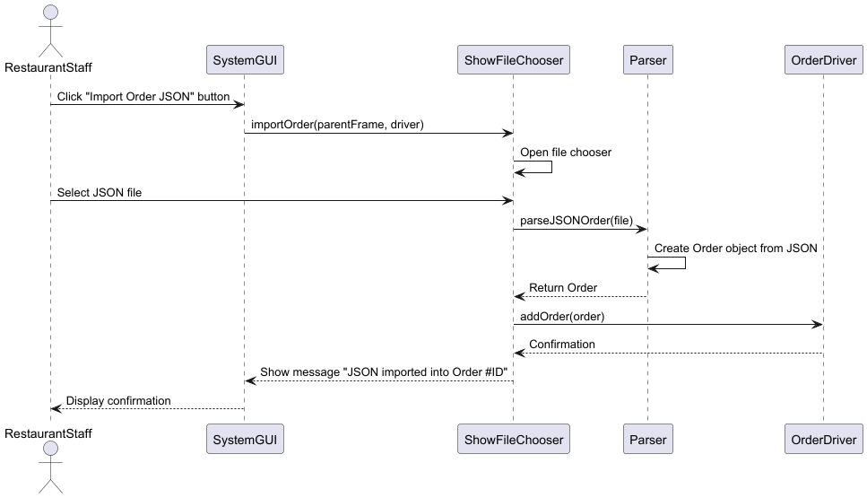

# ICS 372-01: Object-Oriented Design and Implementation

## Overview

This project is a FoodHub Order Management System with a graphical user interface (GUI) for managing restaurant orders. Users (restaurant staff) can import orders from JSON files, start and complete orders, view orders individually or by status, and export all orders to JSON.

## Features

- **Display Order(s):**
  - Display relevant information for order(s): e.g. Items, ID, Price. 
  	- View a single order by selecting from a dropdown.
  	- View groups of orders by status: Uncompleted (Incoming/In Progress), Completed, or All.
- **Start Incoming Order:** Mark an "INCOMING" order as "IN PROGRESS".
- **Complete In-Progress Order:** Mark an "IN PROGRESS" order as "COMPLETED".
- **Import Order JSON:** Add new orders by selecting a JSON file. It will open the code/src/main/java/Resources directory in a file explorer by default, but you may browse and choose a file from elsewhere.
- **Export All Orders to JSON:** Save all orders to a JSON file to the Exports directory, creating such directory if it does not exist.
- **Exit:** Close the application.

## How to Run

- Open the project directory.
- Run Main.java to launch the GUI.
- Import at least one order JSON to use functionality.

## Dependencies

- Java SE 8 or higher
- [org.json.simple](https://github.com/fangyidong/json-simple) (for JSON parsing and writing)
- No external GUI libraries required (uses javax.swing)

## Design

#### Class Diagram

#### Sequence Diagram

## Authors
- Aidan Mahlberg
- Joseph Murtha
- Rocky Xiong
- Ashley Zenzola
